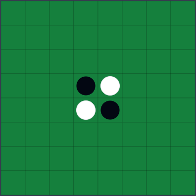
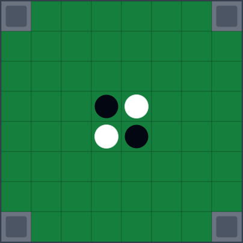
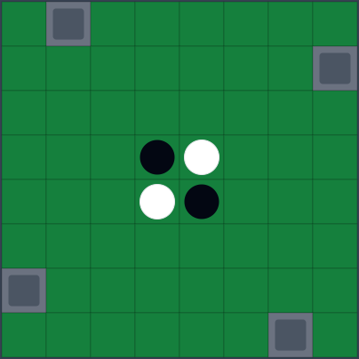
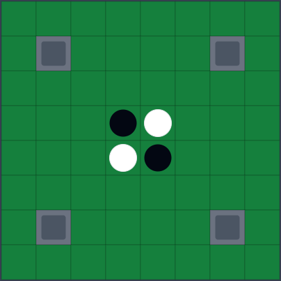
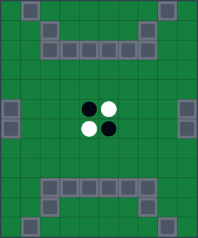
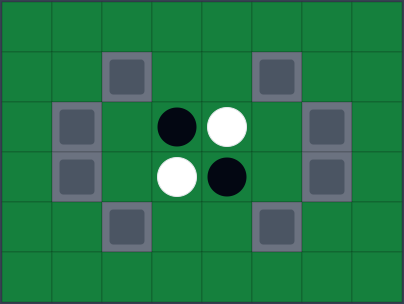
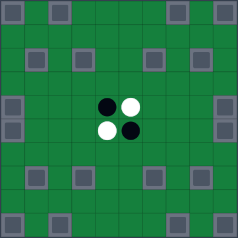

# Expanded Othello AI Arena Environments

A parametric Othello benchmark for evaluating agents under unseen conditions, as introduced in:

> **The Expanded Othello AI Arena: Evaluating Intelligent Systems Through Constrained Adaptation to Unseen Conditions**  
> [Byunghwa Yoo](https://scholar.google.com/citations?user=XIIINK4AAAAJ&hl=en), [Sundong Kim](https://sundong.kim/), [Kyung-Joong Kim](https://cilab.gist.ac.kr/hp/)
> *Transactions on Machine Learning Research (TMLR), 2026*  
> [[Paper]](https://openreview.net/forum?id=WXKQtqPC2d) [[Agent Implementation Code]]

---

## Overview

Each environment is defined by `E = (L, C)`:
- **L** — board geometry: size and obstacle placement
- **C** — win condition: a disc-ratio threshold `K` determining majority or minority victory

The benchmark includes **56 official test environments** spanning 7 board configurations and 8 win conditions.

---

## Installation

```bash
pip install git+https://github.com/blakeyoo/ExpandedOthello-AEC.git
```

Or clone and install locally:

```bash
git clone https://github.com/blakeyoo/ExpandedOthello-AEC.git
cd ExpandedOthello-AEC
pip install -e .
```

**Requirements:** Python ≥ 3.9, numpy, numba, pettingzoo, gymnasium

---

## Quick Start

### PettingZoo AEC Interface

The environment follows the [PettingZoo AEC](https://pettingzoo.farama.org/api/aec/) standard for turn-based two-player games.

```python
from expanded_othello import make_env
import random

env = make_env(board_size=8, win_cond=1.01)
env.reset()

for agent in env.agent_iter():
    obs, reward, terminated, truncated, info = env.last()
    if terminated or truncated:
        action = None
    else:
        # obs: np.float32 array of shape (3, H, W)
        #   channel 0 — my discs
        #   channel 1 — opponent discs
        #   channel 2 — obstacles
        # info["action_mask"]: np.int8 array of length H*W (1 = legal, 0 = illegal)
        valid = [i for i, m in enumerate(info["action_mask"]) if m]
        action = random.choice(valid)
    env.step(action)
```

Agents are `"black"` (player 1, moves first) and `"white"` (player −1).  
Actions are flat indices into the `H×W` grid in row-major order: `action = row * W + col`.

Observations are always from the **current agent's perspective** — channel 0 is always "my discs" regardless of color. This means the same agent can play both sides unchanged, enabling self-play out of the box.

---

### Loading Official Test Environments

```python
from expanded_othello import load_preset, PRESETS

# Load one of the 56 official environments by index (0–55)
env = load_preset(0)   # Standard 8×8, Majority win

# Browse all presets
for p in PRESETS:
    print(p["id"], p["name"], p["win_cond"])
```

**Preset layout** (7 boards × 8 win conditions = 56 total):

| Index | Win Condition |
|-------|---------------|
| 0–6   | (Pure) Majority / Standard (K > 1.0) |
| 7–13  | (Pure) Minority / Inverse (K < 0.0) |
| 14–20 | Majority < 80% (K = 0.8) |
| 21–27 | Majority < 60% (K = 0.6) |
| 28–34 | Minority > 40% (K = 0.4) |
| 35–41 | Minority > 20% (K = 0.2) |
| 42–48 | Majority, 10-turn Blitz (turn limits, K > 1.0) |
| 49–55 | Minority, 10-turn Blitz (turn limits, K < 0.0)|

**Board configurations** (same order within each group, offset +0 to +6):

| Offset | Name | Size |
|--------|------|------|
| +0 | Standard | 8×8 |
| +1 | No Corners | 8×8 |
| +2 | Partial C-Squares | 8×8 |
| +3 | X-Squares | 8×8 |
| +4 | Random Board 1 | 12×10 |
| +5 | Random Board 2 | 6×8 |
| +6 | Random Board 3 | 10×10 |

| Standard | No Corners | Partial C-Squares | X-Squares |
|:---:|:---:|:---:|:---:|
|  |  |  |  |

| Random 1 | Random 2 | Random 3 |
|:---:|:---:|:---:|
|  |  |  |

---

### Custom Environments

```python
from expanded_othello import make_env

env = make_env(
    board_size=(10, 10),          # int or (rows, cols)
    obstacles=[(0, 0), (9, 9)],   # list of (row, col) to block
    win_cond=1.0,                 # K value
    n_turns=-1,                   # max turns (-1 = unlimited)
)
```

---

### Win Condition (`K`) Reference

| K value | Rule |
|---------|------|
| `K > 1.0` | Standard / Pure majority — most discs wins, no draw threshold |
| `1.0`  | Majority — sweeping all discs = draw |
| `0.5 < K < 1.0` | Majority — winning with ≥ K ratio = draw |
| `0.0 < K < 0.5` | Minority — winning with ≤ K ratio = draw |
| `0.0`  | Minority — having zero discs = draw |
| `K < 0.0`  | Pure minority / Inverse — fewest discs wins, no draw threshold |

---

## Implementing Your Own Agent

Implement a class with an `act(obs, action_mask) -> int` method:

```python
class MyAgent:
    def act(self, obs, action_mask):
        # obs:         np.float32, shape (3, H, W)
        # action_mask: np.int8, length H*W  (1 = legal move)
        # returns:     int, flat action index
        ...
```

Use it in a self-play loop:

```python
from expanded_othello import load_preset

my_agent = MyAgent()
env = load_preset(0)
env.reset()

for agent in env.agent_iter():
    obs, reward, terminated, truncated, info = env.last()
    if terminated or truncated:
        action = None
    else:
        action = my_agent.act(obs, info["action_mask"])
    env.step(action)
```

Because observations are perspective-normalized, the same agent instance handles both sides automatically.

---

## Evaluation

Evaluate your agent against built-in baselines across any subset of the 56 official environments:

```python
from expanded_othello import evaluate

results = evaluate(
    my_agent,
    opponent="mcts",           # "mcts" or "random"
    preset_ids=range(56),      # range or list, e.g. [0, 7, 14]
    n_games=10,                # games per environment (colors alternate)
)

for pid, r in results.items():
    print(f"Preset {pid}: win={r['win_rate']:.2f} draw={r['draw_rate']:.2f} loss={r['loss_rate']:.2f}")
```

`MCTSAgent` is a (semi) oracle — it knows the win condition `K` by design, serving as a strong upper-bound baseline.  
Colors alternate across games within each environment to ensure balanced results.
